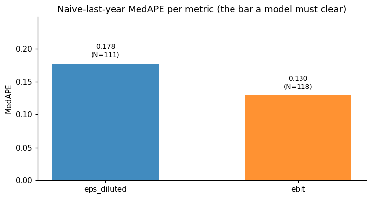
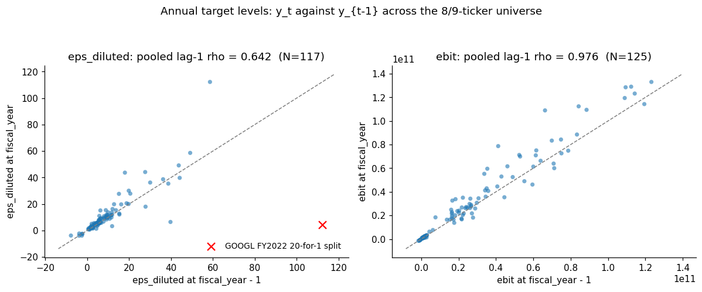

# fmf-public

Clean-room rebuild of a financial-metrics forecasting stack on public data. The differentiator is leakage discipline, not model choice.

## What this is

A from-scratch implementation of the (Point-in-Time layer + LightGBM + TiRex + simplex meta-learner + expanding-window backtester) chain on SEC EDGAR fundamentals, yfinance prices, and FRED macro context. No proprietary code or data. Methodology designed at Bavest on proprietary data; this repo reproduces it on a public-data substrate so the rigor is visible and reproducible.

## Why it is rigorous

Three highlights, in order of how much they tell a reader about the project:

1. **Every leakage vector is enumerated and locked by an invariant that fails at the bug's own surface, not its symptom.** Five vectors of the correctness surface ship with a regression test each, written so the failure message identifies the precise mechanism rather than a downstream metric drift. Walk-through in [docs/FORECASTING.md §3](docs/FORECASTING.md#3-the-correctness-surface).
2. **The comparative-row trap in next-FY target lookup was caught at the plan gate, before any code ran.** Every 10-K carries prior-year FY rows as comparatives, so a naive `accepted_date ASC LIMIT 1` returns the same fiscal year the model already held. Surfaced in the S10 close-read; fixed via a CTE that picks the smallest fiscal_year whose first-visible accepted_date is strictly after as_of. Detail at [docs/FORECASTING.md §3a](docs/FORECASTING.md#3a-comparative-row-trap-in-next-fy-target-lookup-leakage).
3. **In-sample meta-learner stacking was overridden at the plan gate, before any code ran.** Training the simplex blender on the base model's in-sample resub flatters whichever base overfits hardest. Replaced with prior-fold OOS triples; cold-start equal-weight blend during the warm-up. Detail at [docs/FORECASTING.md §3b](docs/FORECASTING.md#3b-out-of-sample-vs-in-sample-meta-learner-stacking-leakage).

The two specific catches are instances of the same method, which is what the first highlight names. A reviewer skimming the repo is evaluating that method, not the saves themselves.

## EDA

One result needs no clicking to see: **two independent paths reach the same baseline.** Notebook 1 measures naive-last-year MedAPE = **0.178** on the full annual history of the fixture (the EDA path, universe-wide, using the same near-zero APE filter the metrics module ships). The headline backtester in [docs/FORECASTING.md §4](docs/FORECASTING.md#4-what-v10-validates) measures naive MedAPE = **0.180** on the 2020-2023 PIT-correct evaluation window. Two paths, one number. That is the load-bearing evidence behind §5a's "naive is genuinely strong on this universe, that is why LightGBM does not trivially beat it" -- not assumed, measured twice. The persistence story behind it is more nuanced than "highly persistent": EBIT pooled lag-1 rho = 0.976 across 125 (security, year) pairs, but EPS is only 0.642 across 117 pairs, with structural breaks where corporate actions intervene (the GOOGL 20-for-1 split of July 2022 is annotated on the scatter).

<p align="center">


</p>

Depth in the three rendered notebooks (Jupyter outputs viewable inline on GitHub):

- [`docs/eda/01_targets_and_persistence.ipynb`](docs/eda/01_targets_and_persistence.ipynb) - keystone: persistence per metric, naive baseline cross-validation, pre/post-COVID regime sensitivity. Includes a cell that walks the backtester's `next_fy_target` and `last_fy_actual` lookups around the GOOGL split so EDA and headline trace to one source.
- [`docs/eda/02_features.ipynb`](docs/eda/02_features.ipynb) - feature distributions across the universe and over 2018-2024, cross-feature correlation with one non-obvious finding, regime sensitivity on the feature side.
- [`docs/eda/03_data_quality.ipynb`](docs/eda/03_data_quality.ipynb) - the bridge to the methodology doc. Walks the comparative-row trap on AAPL FY2023, the field-level coverage recovery on `total_assets`, the HSY EPS source-data tag gap, the SNOW history gap with the filing-latency distribution, and the GOOGL split end to end.

## What v1.0 does not do

Four programs from the design are explicitly **not built** in v1.0 and shape how the headline scoreboard should be read:

- Per-cell noise floor measurement (S15). Without it, the S18 cluster verdict in `docs/specs/alternative_models.md` is `DEFERRED-pending-S15`.
- Search and A/B pinned-window grid (S16).
- Admission gate for alternative models (S17).
- Dead-CV bug flagship reproducer (S19).

Roadmap subsection: [docs/FORECASTING.md §6](docs/FORECASTING.md#6-roadmap-to-v1x).

## Quickstart

```bash
git clone https://github.com/<your-handle>/fmf-public.git
cd fmf-public
uv sync --extra dev
uv run --extra dev pytest -m "not slow"                  # invariant + unit suite
uv run --extra dev pytest -m slow                        # backtester e2e + cache orthogonality
uv sync --extra tirex                                    # add real TiRex (pulls torch)
uv run python scripts/run_headline_scoreboard.py         # 9-ticker headline reproducer
uv run python scripts/run_cluster_win_gate.py            # S18 cluster win-gate
```

## Pointers

- [docs/FORECASTING.md](docs/FORECASTING.md) - the pillar doc; correctness surface, scoreboard, limitations, roadmap, reproducibility.
- [docs/specs/alternative_models.md](docs/specs/alternative_models.md) - cluster verdict log; one row per experiment with the reproducer commit.
- [docs/knowledge/learnings.md](docs/knowledge/learnings.md) - the no-TBD ledger; every methodology lesson carries a reproducer test or script.
- [docs/knowledge/backlog.md](docs/knowledge/backlog.md) - the IDEA-* tickets for v1.x work and known data-source gaps.

## Provenance and licensing

Methodology designed at Bavest on proprietary data; this repo is a clean-room reproduction on public data with no proprietary code or data reused. Specific data-source limitations are stated up front in [docs/FORECASTING.md §5](docs/FORECASTING.md#5-limitations).

- Code: MIT License, see [LICENSE-CODE](LICENSE-CODE).
- Documentation under `docs/`: Creative Commons Attribution 4.0 International (CC BY 4.0), see [LICENSE-DOCS](LICENSE-DOCS).
- SEC EDGAR fundamentals: US government public-domain data ([sec.gov/edgar](https://www.sec.gov/edgar)).
- yfinance prices: derived from Yahoo Finance; the committed fixture slice (9 anchor tickers) is acknowledged with full lineage in the pillar doc.
- TiRex weights: NX-AI/TiRex on HuggingFace under the NXAI Community License Agreement (`license_name: nxai-community-license-agreement-1-0`; see the [model card](https://huggingface.co/NX-AI/TiRex) for the full license text). The repo loads weights at runtime via [tirex-ts](https://pypi.org/project/tirex-ts/); weights are not redistributed here.

See [CITATION.cff](CITATION.cff) for citation metadata.
